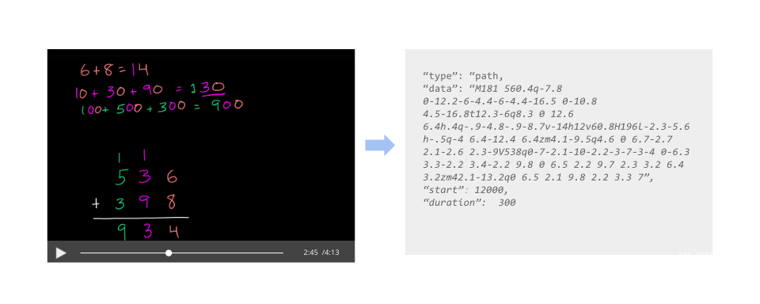
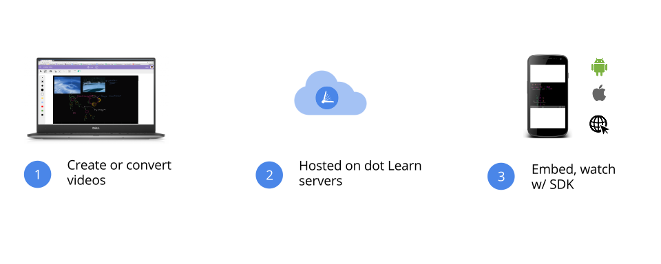

## Overview

dot Learn makes video learning fast and affordable in connectivity-challenged environments through our ".lrn" video file format, which can store hours of video-lessons in a few MB (up to 100x smaller than via comparable mp4s).
This is possible because visual elements on the screen are stored not as streams of pixels, but rather as text-based vectors (equations, curves etc...), enabling efficient data-representation for certain kinds of videos

Like with any file format, there are encoders to create .lrn files, and decoders for playback. To make integration easy, we have developed software to create videos natively in the .lrn format (accessible via the [dashboard](https://dashboard.dotlearn.io)), as well as player software for multiple platforms (see the [api section](#playing-videos) for details).

The video files are hosted on the cloud, and accessed via an API (see [the flow section](#flow) for details)

## Getting started

As these APIs are still a work in progress, the process is a bit manual.

** Get your tokens **

First and foremost, you will need a **client token**, which you can get by contacting [our technical team](mailto:sam@dotlearn.org). The **client token** can safely be embedded in your app, html or in javascript, and will be needed in the SDKs.  Additionally, we will also provide you with a **private token**, which you should store in a safe place on your server (as an environmental variable). The **private token** will be used to for API calls to dot Learn's servers.

** Import the .lrn player **

In order to let users watch .lrn videos in your app/website, you will need to import the .lrn player library into your app / website (you can get them from [the technical team](mailto:sam@dotlearn.org)). Specific details for each platform are show in the [api section](#playing-videos) .

** Video IDs **

To play a video using our SDKs, you will need the video's unique ID. If you don't already have it, you can get a full list of available videos, with descriptions, previews and IDs from [our partnerships team](mailto:tunde@dotlearn.org).

## Playing Videos

All videos are hosted on dot Learn's servers. When you want to watch a video (after importing the library), you will need to provide the _client token_ (see the examples for each platform below) as a parameter, along with the id of the video you want to load, and it will then download and play the video from the server

1. (One time) Get a _client token_ from us
2. Store it in your user's app/website
3. When you want to play a video, call `lrnPlayer.play(clientToken, videoID, ...)` or the equivalent

### Android

In your project, open your_app | Gradle Scripts | build.gradle (Module: app) and add the following compile statement to the dependencies{} section to compile the latest version of our library:

    compile 'org.dotlearn:lrnplayer:0.1.0'

To play a video, you will need to add a .lrn videoView element in your layout

    <org.dotlearn.lrnplayer.LRNPlayer
            android:id="@+id/lrnVideo"
            android:layout_width="match_parent"
            android:layout_height="match_parent"/>

You can open the LRNPlayer in your activity, and then call the `load` function, which will start to download the video.

        LRNPlayer lrnPlayer = (LRNPlayer) findViewById(R.id.lrnVideo);

        lrnPlayer.load(clientToken, videoID);

        lrnPlayer.onReady(new LRNPlayer.onReadyListener(){

                  public void onReady(LRNPlayer lp) {
                       lp.play();   //Default behavior is to play
                   }

        });

        /*
            lrnplayer.onDownloadStart(onDownloadStartListner);
            lrnplayer.onDownloadComplete(onDownloadCompleteListner);
            lrnplayer.onDownloadProgress(onDownloadProgressListener);
            lrnPlayer.onMetaData(onMetaDataReadyListener);
            lrnPlayer.onError(onErrorListener);
            lrnplayer.play();
            lrnplayer.pause();
            lrnPlayer.seek(1000); //millisenconds
            lrnplayer.stop;
        */
### iFrame

To view a .lrn video on the web, the easiest way is to use an iframe. You need to provide 2 parameters - the client token, and the videoID:

        <iframe
        src="https://api.dotlearn.org/embed/token/myClientToken/video/selectedVideoID"
        height="600" width="800" />

### Javascript

You can download the .lrn player via CDN:

    <script src="https://cdn.dotlearn.io/lrn.js">

Or, you can get the player via npm, or from "libraries" tab in [dashboard](https://dashboard.dotlearn.io))

    var options = {autoplay: true};
    lrn.load(clientToken, 'myVideo', 'idOfDivToPlaceVideo', options, function(video){

       /*
        video.onDownloadStart(function(){});
        video.onDownloadComplete(function(){}));
        video.onDownloadProgress(function(downloadProgress){}));
        video.onMediaReady(function(){}));
        video.onMetaData(function(metaData){}));
        video.onError(function(e){}));
        video.play();
        video.pause();
        video.seek(1000); //milliseconds
        video.stop;

        */
    });

### Security

We use industry best-practice cryptographic protocols for encryption and security. Should you require even more (financial-institution-level) security, we will be soon releasing an additional APIs to provide more granular access to videos - such authorizing individual users and temporary download URLs. If you have questions, you can reach out to [the technical team](mailto:sam@dotlearn.org).

## Creating videos

We are still working on the documentation for creating videos

