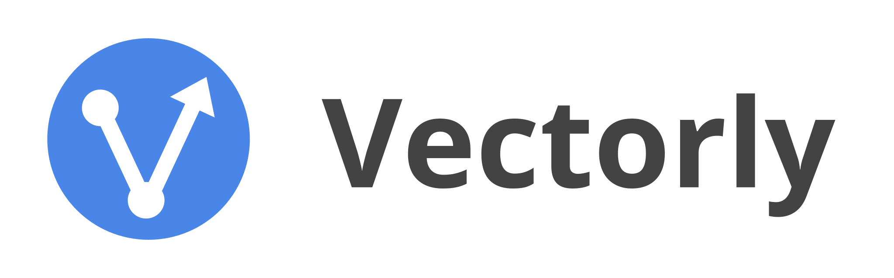
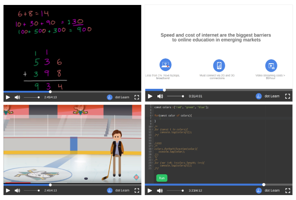
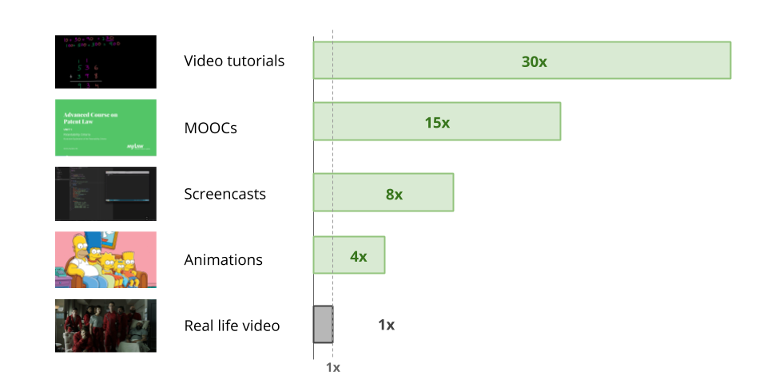

## Overview

Vectorly is a video compression startup from MIT, whose vectorization technology makes videos up to 50x smaller without quality loss. Our technology is primarily effective for animations and video-learning, and through our API video compression service, we work with video-content providers make their videos HD and data-light, reducing server costs and improving user experience.

## Compression Technology

Vectorly achieves "compression" through it's "vector"format, which is much more efficient than mp4 for certain kinds of video. By converting from mp4 to our vector format, 
vectorization outperforms Google's best compression algorithms by up to 50x -making videos load much faster, using much less data, than is possible with YouTube.

### Vector based video

The heart of our technology is a file format for video called ".vvid" which uses vector graphics, rather than pixels, to show what you see on the screen. 

".vvid" videos are up to 50x smaller than mp4 equivalents, because you need less data to show the same thing. In many cases, ".vvid" videos are also higher definition.

The content in the video determines how much smaller a ".vvid" video will be, compared to an mp4. ".vvid" files are much smaller than mp4 files, when the video is geometric - i.e. screencasts, animations and anything not recorded with a video camera. For real-life videos (your average series on Netflix), vvid files are equivalent to mp4s.

### Video Vectorization

Vectorly offers a video "compression service", whereby through our [web platform](https://dashboard.vectorly.io/signup/) (and soon our API), we will compress videos.

By "compression", we specifically mean "conversion" - and our service entails converting videos to our data-light vector based format. 

This has several implications for our service:

1. On top of being smaller, the videos we return will actually be higher quality than the original, which is impossible with normal compression. 

2. To include ".vvid" videos in your app, website - you would need to use a library or a plugin (see [Playing videos](playing.md)) . 

3. ".vvid" videos cannot be uploaded to YouTube or other video-sharing websites (though you can just upload the mp4 versions)

### YouTube

YouTube, Vimeo and other video streaming platforms do not support ".vvid" videos yet.

If these websites are critical to your strategy, and video file size is not a concern for your end users, we suggest continuing to upload mp4 versions to these websites. 

So, for example: 
You make and publish videos online. You have your own website, and you also publish your videos to YouTube.

Let's say you have a 100MB video called "MyVideo.mp4"

* You can upload "MyVideo.mp4" to YouTube

* You can convert "MyVideo.mp4" to "MyVideo.vvid", which is 10MB, and put it on your website
    <iframe src="https://api.vectorly.io/embed/demo/9716efb8-f4a8-475b-a28b-4d7fa70b08bb"  
    width="800" height="515" 
    frameborder="0" allowfullscreen  />
* You share the 100MB "MyVideo.mp4" video on YouTube to your YouTube users

* You share the 10MB "MyVideo.vvid" with users on your website

### What can be vectorized

You can give us **any** video, and we can turn it into a ".vvid" file. 

Our vector compression technology is, however, most effective on geometric videos such as slide lectures, screencasts and animations. Basically anything that isn't real-life video

For full real-life videos, vectorization will be equivalent to what you would find on YouTube. See below for average benchmarks

### Examples

Below are some examples of vector based video:

* [Khan Academy Example](https://api.dotlearn.io/embed/alpha/khan-academy-style)
* [Powerpoint Slide Example](https://api.dotlearn.io/embed/alpha/powerpoint-style)
* [College Lecture Example](https://api.dotlearn.io/embed/alpha/coursera)

## Getting started

We compress videos. If you have your own website or app, or if you currently distribute videos offline to your users, we can compress your videos.

To get started, sign up [here](https://dashboard.vectorly.io/signup)

If you have any issues, you can contact our team at <team@vectorly.io> 

### Putting videos on your app or website ###

In order to let users watch .vvid videos in your app or website, you will need to import the vvid player library into your app or website. Specific details for each platform are show in the [Playing videos](playing) section.

