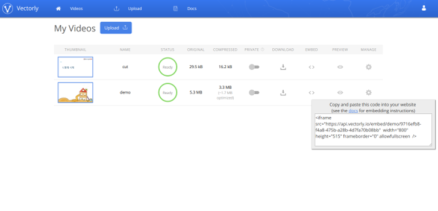
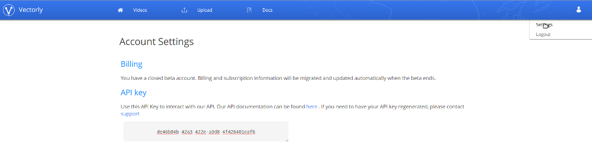
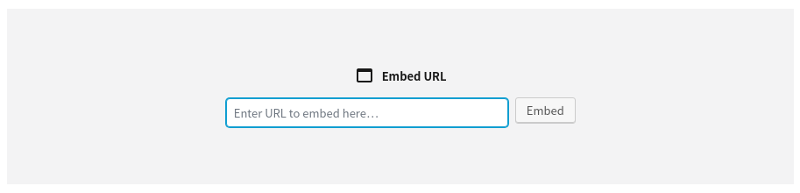
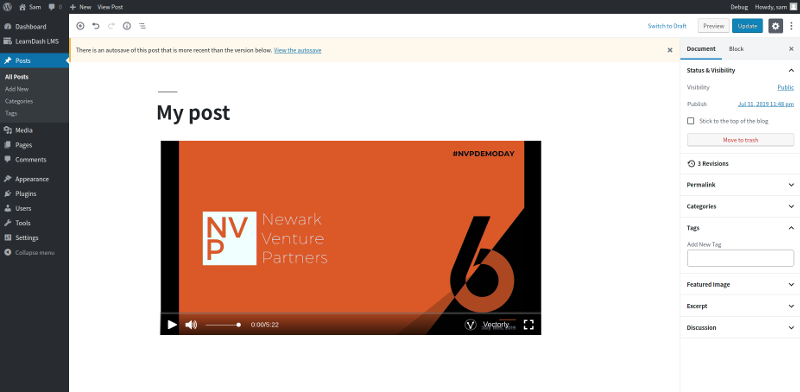

# Playing Videos

Through vectorly's web platform, you can compress and host your videos, and deliver the videos to your users using our embed links, libraries or plugins.

# Web

### iframe Embed links

The easiest way to deliver videos to your users is through our embed link. When in the dashboard, you will be able to see all of our videos. For each videos, there will be a code "< >" icon, which provides an example embed url





An example embed code would look like this

    <iframe src="https://api.vectorly.io/embed/demo/9716efb8-f4a8-475b-a28b-4d7fa70b08bb"
    width="800" height="450"
    frameborder="0" allowfullscreen  />


Placing the embed link in your website will load the video, if your video is public. If you choose to make your video private, you will need to add a bit of code to your server to authorize each user (see the Security section below)


** Sizing **

By default, the video will try to scale to the size of the iframe, while maintaning the aspect ratio of the video.

** Parameters **

Additionally, there are several other parameters you can pass via the src url, to configure playback of the video, using the following format

        <iframe
        src="https://api.vectorly.io/embed/demo/[video-id]/parameter1/[value1]/parameter2/[value2]" />


* **height** You can set the height in pixels of the video to be loaded. This will override the default sizing discussed above, and set the height of the video to the specified value. The video will be centered vertically within the iframe, regardless of whether the video is larger or smaller than the iframe
* **width** You can set the width in pixels of the video to be loaded. This will override the default sizing discussed above, and set the width of the video to the specified value.  The video will be centered horizontally within the iframe, regardless of whether or not the video is larger or smaller than the iframe.
* **autoplay** Whether the video plays automatically when loaded (default, false)

For example, you can load a video to autoplay, with height=900, width=1600, audio-quality=mp3_24 and autoplay=true with the following code:

        <iframe
        src="https://api.vectorly.io/embed/token/[token]/video/[video-id]/width/1600/height/900/autoplay/true" />


Keep in mind that the /video parameter need to be specified first.  The order of the subsequent parameters doesn't matter.


### Security

When hosting your videos with Vectorly, you can make your videos public or private.

#### Public videos
If your videos are public, you will only need to copy and paste the embed link into your website to play back the video. The iframe embed code contains an obscure, long-form url similar to Youtube's "unlisted videos" - such that only those who know the link can access the video.

We don't publically host your videos on a common video portal, like YouTube or Vimeo. When your upload videos on Vectorly's platform, you are the only one who can even see that the video exists. The videos are only viewable via the embed code, meaning you can choose how to host them.

#### Private video
If you need greater control of who can watch your videos, you can make your videos private. This allows you to control access to your videos, and authorize only specific users (for example, paying customers). To do this, we assume you have some user management system, and you will need to write a bit of server code.

To authorize an individual user to watch a specific video, you will need to:
* Create a JWT token on your server
* Sign the JWT with your API key
* Add the token as a parameter to the embed link

**Getting your API key **
You can get your API key in the "Settings page", which you can view by clicking on the user icon in the top-right hand corner.





**Creating a token **
You will need to create a JWT token. You can find out about JWT tokens [here](https://jwt.io/). You can easily create JWT tokens with 1 line of code, using libraries for every major language.

For the token, you need to specify 2 parameters: the video id, and the expiry data.

***video_id*** : Id of the video you want to provide access to. This is the UUID in the embed and preview links

***expiry***: [Epoch time](https://en.wikipedia.org/wiki/Unix_time), in milliseconds, for when you want the token to expire

An example payload would look like this

      {
        "video_id": "9716efb8-f4a8-475b-a28b-4d7fa70b08bb",
        "expiry": 1549403395728
      }

You would then sign the token with your API key


** Creating the embed link url **

You will need to point the iframe to a new url, using the following schema

    https://api.vectorly.io/embed/v1/video/[video-id]/token/[token]

Your embed code would then look like this:

       <iframe src="https://api.vectorly.io/embed/v1/video/[video-id]/token/[token]"
        width="800" height="450"
        frameborder="0" allowfullscreen  />

If constructed properly, your video should load.

Because each token is unique, time limited and generated at runtime, a user can't just copy & paste the embed link and put it on their own website. Because the token is signed by your API key, we can ensure that you, and only you, are authorizing individual users to watch videos.


### Javascript


As an alternative to the iframe, you can use the javascript player directly

    <script src="https://cdn.dotlearn.io/vv/1.0.4/vv.js">

#### Loading a vectorly video

To load a video, just define a video tag

    <video src="vectorly://[video-id]"  type="video/lrn"  id="myVideo" >

 Make sure you specify the type of the video as "video/lrn", and our library (vv.js) will automatically detect the video tag, and load the video


 For private videos, you can add the "x-auth-token" property in the video tag

     <video src="vectorly://[video-id]"  type="video/lrn"  id="myVideo"  x-auth-token="[auth-token]"  >


#### Video Controls

You can get more fine-grain control of the video in Javascript using the VVideo constructor. Once the video is loaded, you can programatically access video playback controls.

    <video src="vectorly://[video-id]"  type="video/lrn"  id="myVideo" ></video>

    <script>

        var video = new VVideo("#myVideo");

        video.ready(function (){

              //Video info
              video.getTime();
              video.getDuration();

              //Playback Controls
              video.play();
              video.seek(1000); //Seek to 1s
              video.pause();

              // Event Listeners
              video.onPlay(function(){

              });

              video.onPause(function(){

              });

              video.onSeek(function(newTime){

              });


              video.onEnd(function(){

              });

              var qualities = video.getQualities();

              video.setQuality(qualities[0]); // HD


        });

    </script>


#Android

This is our proposed API, and our Android Library is not live yet

VectorlyPlayer is a simple View that you can plugin to your Android apps to quickly get vectorized video playback working.

### Install
The Gradle dependency is available via jCenter. jCenter is the default Maven repository used by Android Studio.

Add this in your (app) module's `build.gradle` file:
```groovy
    implementation 'io.vectorly.player:1.0.0'
```

### Usage

#### Layouts
The layout for your player Activity can be very simple. You only need a VectorlyPlayerView, all the controls and everything else are created by the player view itself.
```xml
    <io.vectorly.player.VectorlyPlayer
        android:id="@+id/vectorly_player"
        android:layout_width="match_parent"
        android:layout_height="wrap_content" />
```

<b>Note:</b> Ensure the `layout_height` is set to `wrap_content`. Based on the width of the view, the height is automatically calculated to maintain a 16:9 aspect ratio.

#### Basic Code Setup

Playing a video with the View is very simple. You just need to pass an `aceesToken`, `videoId`, `autoStart` flag and an `OnPreparedListener` that gets notified when the video is ready.
```kotlin
    val accessToken = "accessToken"
    val videoId = "videoId"

    val vectorlyPlayer = findViewById<VectorlyPlayerView>(R.id.vectorly_player)
    vectorlyPlayer.prepare(accessToken, videoId, false, object: OnPreparedListener {

        override fun onPrepared(vectorlyPlayer: VectorlyPlayerView) {
            // The video has been prepared and is ready for playback. If you set autoStart
            // to false, you can manually start playback here, else you don't have to do
            // anything here
            vectorlyPlayer.start()
        }

    })
```

You can control video playback programmatically using any of the functions below:
```kotlin
    vectorlyPlayer.start() // Starts video playback
    vectorlyPlayer.pause() // Pause video playback
    vectorlyPlayer.seekTo(seekPos) // Seeks to the specified position
```

Before calling any of the playback control functions above, ensure that a video has been prepared on the player view. If a video has not been prepared and no error listener was set, the control function will throw a `VectorlyPlayerNotPreparedException` exception. To set an error listener and prevent an exception from being thrown, use the code below:
```kotlin
    // Set a listener that gets called when an error occurred while working with the VectorlyPlayerView
    vectorlyPlayer.setOnErrorListener(object: OnErrorListener {

        override fun onError(vectorlyPlayer: VectorlyPlayerView, e: VectorlyPlayerException) {
            // Do something when an error occurs
        }

    })
```

<b>Note:</b> Its really important that you call the `vectorlyPlayer.pause()` function in your `Activity` or `Fragment` `onPause` lifecycle callback. If you do not explicitly pause playback, the video and audio will continue to play even if the user is in another Activity.

If the player view is no longer needed or the `Activity` is being destroyed, you should call the `release` function on the View to release system resources.
```kotlin
    vectorlyPlayer.release()
```

To support the full screen functionality, you will need to set an `OnFullScreenToggledListener` that toggles between landscape and portrait orientation. We have provided a helper class called `FullScreenUtils` to help you toggle the phone orientation:
```kotlin
    // Sets a listener that gets called when the full screen button is clicked
    vectorlyPlayer.setOnFullScreenToggledListener(object: OnFullScreenToggledListener{

        override fun onFullScreenToggled(vectorlyPlayer: VectorlyPlayerView) {
            // The full screen button was clicked, toggle the phone orientation
            FullScreenUtils.toggleOrientation(activity)
        }

    })
```

#### Additional functionality

If you want to show some information about the video, you can set an `OnMetadataLoadedListener` that gets called when the video metadata is ready (loaded):
```kotlin
    // Sets a listener when the video metadata is loaded
    vectorlyPlayer.setOnMetadataLoadedListener(object: OnMetadataLoadedListener{

        override fun onMetadataLoaded(vectorlyPlayer: VectorlyPlayerView, metadata: Metadata) {
            // Do something with the video metadata
        }

    })
```


You can also get notified when a video playback completes by setting an `OnPlaybackCompletionListener` listener:
```kotlin
    // Set a listener that gets notified when the video playback completes
    vectorlyPlayer.setOnCompletionListener(object: OnPlaybackCompletionListener {

        override fun onPlaybackCompletion(vectorlyPlayer: VectorlyPlayerView) {
            // Do something when the video completes
        }

    })
```

#### Offline Playback


You can securely download and store videos for offline playback within the app using the VectorlyAssetManager class.

```kotlin
    VectorlyAssetManager.downloadEncrypted(accessToken,  videoId, object: VectorlyAssetManager.OnDownloadedListener {

          override fun onDownloadProgress(accessToken: String, videoId: String, progress: Float) {
                    // Do something with the download progress.
            }

          override fun onDownloadSuccess(accessToken: String, videoId: String) {
                    // Do something with the download progress.
            }

          override fun onDownloadError(accessToken: String,   videoId: String,  t: Throwable) {
                     // An error occurred while downloading the video
            }

    })


```

To play back the downloaded video

```kotlin
    val videoId = "videoId"

    val vectorlyPlayer = findViewById<VectorlyPlayerView>(R.id.vectorly_player)
    vectorlyPlayer.prepareDownloaded(videoId, false, object: OnPreparedListener {

        override fun onPrepared(vectorlyPlayer: VectorlyPlayerView) {
            // The video has been prepared and is ready for playback. If you set autoStart
            // to false, you can manually start playback here, else you don't have to do
            // anything here
            vectorlyPlayer.start()
        }


        override fun onPreparedError(vectorlyPlayer: VectorlyPlayerView, t: Throwable) {
            // An issue ocurred while trying to load the video

        }

    })
```

You can also list downloaded video assets.


```kotlin
    VectorlyAssetManager.listDownloadedVideos(object: VectorlyAssetManager.ListCallback {

                override fun onListLoaded(sections: List<Section>) {
                    // The list of videos
                }

                override fun onListFailed(t: Throwable) {
                    // An error occurred while loading video list
                }

    })


```


And remove video assets


```kotlin
    VectorlyAssetManager.removeDownloadedVideo(videoId, object: VectorlyAssetManager.ListCallback {

                override fun onRemoved(videoId: String) {
                    // Video has been removed
                }

                override fun onRemoveFailed(videoId: String t: Throwable) {
                    // An error occurred while removing the Video
                }
    })

```


To debug the player and view the logs, you can enable debugging with just one line of code:
```kotlin
vectorlyPlayer.debug(true)
```

That's all. You could see all this in action in the sample project in the `app` module.


# Other services


Our videos can be played anywhere where you can use embed codes. We're created instructions specifically for several popular plaforms, including

* [Wordpress](#Wordpress)
* [Moodle](#Moodle)
* [Teachable](#Teachable)

If you use another platform and need help integrating our videos, please reach out at [team@vectorly.io](mailto:team@vectorly.io)


### Wordpress

It is extremely easy to use Vectorly's videos in Wordpress or Wordpress based systems (like LearnDash).

You can install Vectorly's wordpress plugin [here](https://cdn-dotlearn-io.s3-eu-west-1.amazonaws.com/wordpress/vectorly.zip)

When the plugin is installed, you can then put Vectorly urls directly into the the embed block in wordpress



As soon as you paste a vectorly link into the embed block, your video should appear




### Moodle
You can easily put Vectorly videos into Moodle using the embed function


You can find detailed instructions  on the [Moodle documentation page](https://docs.moodle.org/37/en/Video#Using_embed_code_to_display_external_videos).


### Teachable

You can easily put Vectorly videos into your teachable courses via the "Add Code" function in the Curriculum editor.

<iframe src="https://api.vectorly.io/embed/demo/616cb525-8f3a-46f1-937c-04a340aa5ee5"  width="800" height="450" frameborder="0" allowfullscreen  ></iframe>

You can find detailed instructions  on the [Teachable support page](https://support.teachable.com/hc/en-us/articles/222637507-Embed-Forms-and-Other-Content-into-Lectures).


<script>
    window.intercomSettings = {
        app_id: "g1cpn78z"
    };
</script>
<script>(function(){var w=window;var ic=w.Intercom;if(typeof ic==="function"){ic('reattach_activator');ic('update',w.intercomSettings);}else{var d=document;var i=function(){i.c(arguments);};i.q=[];i.c=function(args){i.q.push(args);};w.Intercom=i;var l=function(){var s=d.createElement('script');s.type='text/javascript';s.async=true;s.src='https://widget.intercom.io/widget/g1cpn78z';var x=d.getElementsByTagName('script')[0];x.parentNode.insertBefore(s,x);};if(w.attachEvent){w.attachEvent('onload',l);}else{w.addEventListener('load',l,false);}}})();</script>