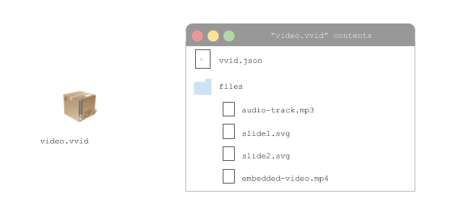

## Vectorization Technology

Vectorly is able to achieve high levels of "compression" because of it's vector-grahics video codec, which is much more data-efficient for some kinds of video than existing video codecs like h264

### Vector based video

Normal videos, like the ones you see on Netflix or YouTube, are just sequences of images which get updated quickly on the screen, to create the illusion of motion. Each image is composed of "pixels" - individual dots of color. Higher resolution means more pixels, better visual quality, and bigger file sizes.

In contrast, we use a concept called "vector-graphics" to render video. Instead of pixels, we represent everything on the screen using shapes, lines and curves, which can be represented as mathematical equations.

Using these mathematical equations, we can re-draw any arbitrary shape on the screen - from the letter "T" to Bart Simpson's head. Furthermore, by adding information such as color, position on the screen, and how they move or change shape over time, you can create whole videos - including entire episodes of the Simpsons, with just sequences of mathematical equations.

### VVID file format

The core of our technology is ".vvid", a new file format for video which uses vector graphics, rather than pixels, to encode visual elements on the screen. For purely computer generated videos (such as screencasts or animations) it is up to 100x more data-efficient than using raster-graphics (mp4). 

The vvid videos are just zip files containing a master json file, and embedded media files, according to the vvid file standard.
 
 
 

The file standard is largely based off of SVG, but importantly deals heavily with moving elements and transitions over time.

The file standard is really in a prototype stage right now, and will undergo massive overhauls as we bring our vectorization service to product. You can find the preliminary prototype draft specifications [here](https://docs.google.com/document/d/1z4cqAmHZnFFYAt9elYkwj1z4_dywjA78BzOmQ_0liPc/edit?usp=sharing)

### What vector-graphics videos look like

Below is an example of some vector graphics videos, with MP4 and vector graphics files for comparison

Vector videos are just zip files, with text files inside

#### Khan Academy Style
* [MP4 file](https://www.vectorly.io/demo/1/khan.mp4)
* [Vector file](https://s3-us-west-2.amazonaws.com/vv-lrn-dist-public/khan-academy-style.lrn)
* [Watch the vector file](https://api.dotlearn.io/embed/alpha/khan-academy-style)

#### Coding lecture Style
* [Vector file](https://s3-us-west-2.amazonaws.com/vv-lrn-dist-public/coding-demo.lrn)
* [Watch the vector file](https://api.dotlearn.io/embed/alpha/coding-demo)

#### Animation
* [MP4 file](https://www.vectorly.io/demo/5/animation-demo.mp4)
* [Vector file](https://www.vectorly.io/demo/5/archive.zip)
* [Watch the vector file](https://vectorly.io/demo/5/)

### VVID Player

To play .vvid files, we have developed a [Javascipt player library](https://github.com/dotLearn/Vectorized-Video-Player-Javascript), as well as an Android wrapper library. 

We are working on native Android and iOS libraries, as well as desktop players for Windows, Mac and Linux.
 
 To use these libraries in your app or website, please check out [Playing Videos](playing.md)

### Vectorization

Our vectorization algorithms take in standard video formats (mov, avi, mp4), and convert them using our encoding technology to a .vvid format. You can get started vectorizing videos [here](https://dashboard.vectorly.io/signup)

