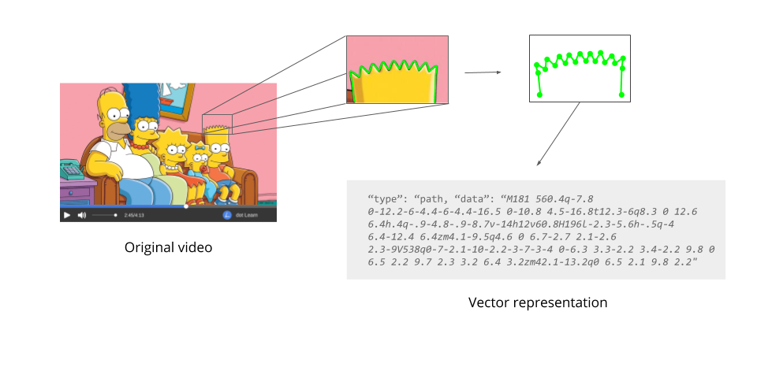
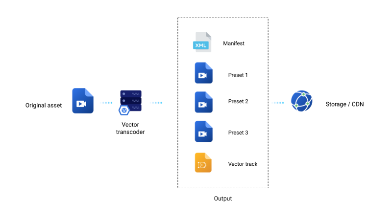

# Video Vectorization

Vectorly is developing a new kind of video compression technology, which uses computer vision and vector graphics to reduce bitrates for video content by an order of magnitude (or more) compared to HEVC, while **improving video** quality. 

This would be primarily effective for "vector friendly" video content, which would include animations, screen-casts, many e-learning videos and even 3d gaming content.

By leveraging existing vector-graphics rendering capabilities on all devices, this codec wouldn't require end-users, OEMs or browsers to install special software to enable playback of these videos.

__We are still in the early phases of developing this technology__. In early 2020, we plan to release several demos and a white paper outlining our technology and progress in more detail.

## The Core Idea

The core insight behind this project was that you could use vector-graphics based animations to simulate "videos" in a way that is indistinguishable from a traditional raster-graphics based video format such as an h264 video stream in an MP4 container.

### Raster Graphics

Normal videos, like the ones you see on Netflix or YouTube, are just sequences of images which get updated quickly on the screen, to create the illusion of motion. Each image is composed of "pixels" - individual dots of color. Higher resolution means more pixels, better visual quality, and bigger file sizes.

Almost all video on the internet is of this format, known as "raster graphics". Video compression algorithms like h264 are just very efficient at using fewer data-points to reconstruct the pixels in any given frame, and at storing only the differences in pixels between frames of a video. 

### Vector Grapics video

In contrast, we use a concept called "vector-graphics" to render video. Instead of pixels, we represent everything on the screen using shapes, lines and curves, which can be represented as mathematical equations (vector graphics).

Using these mathematical equations, we can re-draw any arbitrary shape on the screen - from the letter "T" to Bart Simpson's head. Furthermore, by adding information such as color, position on the screen, and how they move or change shape over time, you can create whole videos - including entire episodes of the Simpsons, with just sequences of mathematical equations.

### Why vectorization?

The core insight behind this project was that for a certain kind of "vector-friendly" video content (animations, game-streaming and e-learning), storing the video using vector graphics would be much more efficient than using raster graphics (in some cases, up to 2 orders of magnitude more efficient).

This idea is not substantively different from the idea of Flash based animations about 20 years ago. Why do this now?

**No need for a decoder**: Most devices now support SVG, HTML5, WebGL, Canvas and/or some form of vector-graphics rendering. That lets you render vector-graphics content on any device without requiring end-users, OEMs or browsers to install special software to enable playback of vector-graphics content. App developers would only need to include an appropriate library or SDK in their website or app to enable playback within native or 3rd player video players.

**Computer vision**: Our patented vectorization technology relies heavily on computer vision & Machine Learning to convert raster-graphics videos to a vector format. Leveraging the advancement & commoditization of Computer Vision & AI, and the ease of running batch computer-vision heavy tasks on the cloud, it's feasible to 'vectorize' large volumes of video at scale now, in a way that wasn't possible even 5 years ago.

 
### Vector graphics video streaming
 
We propose adapting existing vector graphics formats (such as SVG, lotte.js or WebGL) for modern video streaming architectures [as proposed by the W3C](https://dev.w3.org/SVG/modules/streaming/). In such an architecture, vector data would be compiled to a vector format (e.g. SVG), which would then be chunked (by time intervals) and stored into an MPEG container. The result would be an mp4 file which uses a "vector" video codec, which could be played back in most browsers as shown below:

    <script src="svg-video.js">
    <video src="my-vector-video.mp4" type="video/svg+xml">
    // This will work today on most browsers

Where the "svg-video.js" javascript library enables playback of the video through the native video interface, as if SVG were a natively supported video codec.

#### DASH & HLS

Additionally, in modern video streaming architectures (DASH, HLS etc..), this vector track could be considered one of multiple available video tracks.

If the client supports vector-playback (via the javascript library), then the vector track will be available for playback.

    <script src="svg-video.js">
    <video>
        <source src="stream.m3u8" type="application/x-mpegURL">
    </video>

If the client doesn't support vector playback, then the client still has alternative regular video streams available for playback.

## Proof of concept

Examples of vector based videos

#### Khan Academy Style
* [Watch the vector file](https://vectorly.io/demo/1/)

#### Animation
* [Watch the vector file](https://vectorly.io/demo/5/)

## Currently in Development

We are still currently developing the technology, and plan to release demos and a whitepaper of the technology in early 2020, with proofs of concept for a variety of different video styles, including:

* Cartoons
* Anime
* 3D animations
* Video games

