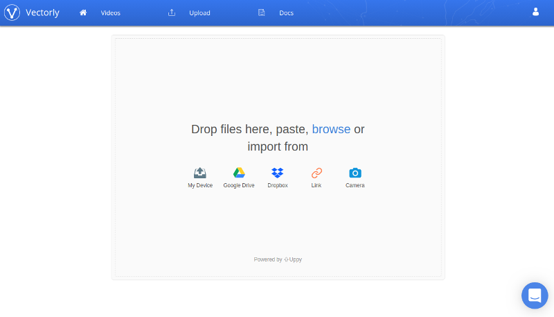
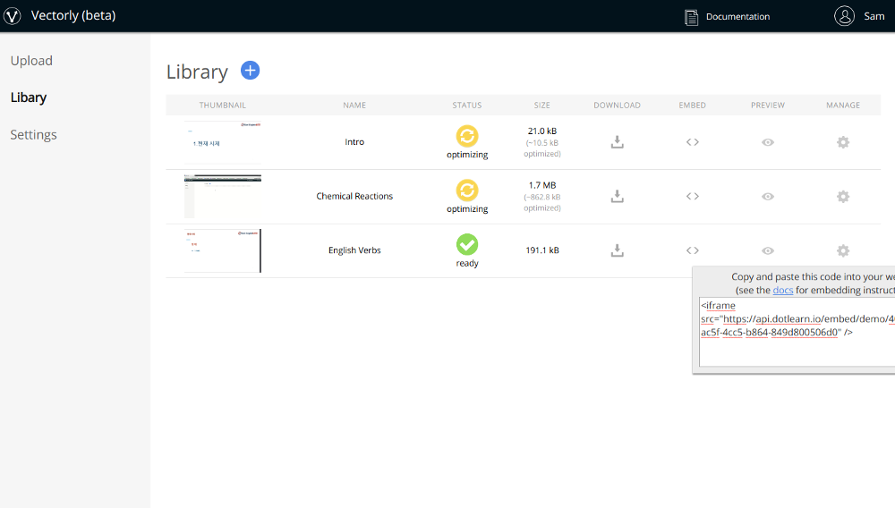

# Uploading Videos

You can compress videos through our API, or through a dashboard web interface. 

Using either interface, you can:

* Upload videos from your computer, or import from a 3rd party service such as Google Drive, Dropbox or via URL (e.g for AWS S3)
* View all videos, and their current status (e.g. processing, ready)
* Get the embed code to playback video on your app or website
* Get the links to download your video

First, you will first need to create an account by signing up [here](https://vectorly.io/signup).

## Dashboard

The easiest way to get started uploading and compressing videos is through our [dashboard](https://dashboard.vectorly.io). Once you sign up and login, you can begin uploading videos to compress.

### Uploading

Once you login to the dashboard, you can access the upload by clicking the "upload" tab in the top menu. This will bring you to the upload page (below)

Through the upload page, you can upload videos to our server from your computer, or via a 3rd party service (e.g. Dropbox or Google Drive) or via URL (e.g. AWS S3).

#### From Your Device

How to upload to videos from your computer

<iframe src="https://api.vectorly.io/embed/demo/62c78624-08a8-4251-b8ae-fea63afd89ae"  width="800" height="515" frameborder="0" allowfullscreen  ></iframe>

#### From Google Drive

How to import videos from Google Drive

<iframe src="https://api.vectorly.io/embed/demo/4fe2e111-3c22-442c-9d9c-f97c22609ce0"  width="800" height="515" frameborder="0" allowfullscreen ></iframe>

Keep in mind: If you are importing from Google Drive  **nothing is being uploaded or downloaded from your computer**. You can safely close the window, and videos will be imported in the background, and you can monitor ongoing upload process from the main dashboard library.

#### From Dropbox

How to upload videos from Dropbox

<iframe src="https://api.vectorly.io/embed/demo/80e4690d-14d0-4a31-8902-31b4694045d8"  width="800" height="515" frameborder="0" allowfullscreen  ></iframe>

Keep in mind: If you are importing from Dropbox  **nothing is being uploaded or downloaded from your computer**. You can safely close the window, and videos will be imported in the background, and you can monitor ongoing upload process from the main dashboard library.

### View video library

You can view your library of videos by clicking on the "home" tab in the top menu. Here, you can see all your videos, their current status, as well as the file size reduction when videos are fully compressed. 

Additionally, the library page includes basic controls for

* Video privacy
* Video downloading
* Previewing the video
* Obtaing the code for embedding videos

### Download

(In beta): You can click the download button for each video to download a compressed mp4.

### Embed

The dashboard also provides code for embedding videos into your app / website through the iframe. 

You can see the embed code by clicking on the "code" icon next to each video. You can copy the embed code just by clicking on the pop-up with the embed code.

See [playing videos](playing.md) for more details.

## API 

### Authentication

To use the API, you'll need your Vectorly login email and password. With these, you can request an authentication token, which you can use to make other API calls. You can request an authentication token by making a JSON post request to "https://backend.vectorly.io/auth/login", using the same login credentials you use to log into the dashboard. Below is a CURL example

    curl --header "Content-Type: application/json" \
      --request POST \
      --data '{"username":"myloginemail@company.com","password":"mypassword123"}' \
      https://backend.vectorly.io/auth/login

You will get back a JSON object, with a token field

    {
        "token":"eyJ23fjs2...",
        "username":"myloginemail@company.com",
        "bio":{
            "first_name":"Jane",
            "last_name":"Doe"
        }
    }

You will need this token to make subsequent API call requests. The token has a lifetime of 30 days.

###  Uploading

#### What You Will Need

To upload videos to Vectorly programmatically,  you will need to use a tus client. Tus is an open source protocol that Vectorly uses to upload large files. This tutorial will use the tus python client, available through pip3, python 3’s package manager.

    pip3 install -U tus.py
    
    
You will also need an API key

**Getting your API key ** 

You can get your API key in the "Settings page", which you can view by clicking on the user icon in the top-right hand corner. 

 

    
    
#### Uploading your video

Once tus is installed, you can upload videos using the following parameters:

    tus-upload --metadata api_key <api-key>  <file.mp4> https://tus.vectorly.io/files/
    
   
In the beginning of the response from tus, you’ll see the endpoint for getting information about your newly uploaded video.

    INFO Creating file endpoint
    INFO Created: https://tus.vectorly.io/files/[upload-id]
        
Once the video is done uploading, you can see it in the list of videos (see [monitoring](#monitoring)). The name of the video will be equivalent to the original name of the video uploaded. To specify a custom name for the video, you can add a name parameter to the upload call:

    tus-upload --metadata api_key <api-key>   --metadata name <name>  <file.mp4> https://tus.vectorly.io/files/

You can correlate uploaded videos with the output of "https://backend.vectorly.io/video/list" either by referencing the name of the video, or the upload_id

### Monitoring

You can also get a full list of videos, and their current status by making a JSON post call to "https://backend.vectorly.io/video/list". See below for a curl sample:

    curl --header "Content-Type: application/json" \
      --request POST \
      --data '{"token":"eyJ0e...."}' \
      https://backend.vectorly.io/video/list
    
The output will be a JSON array of all your videos, as well as their current status 

    [
       {
          "id":"a271e339-61b2-4f78-9905-a2f881698655",
          "name":"My video",
          "status":"ready",
          "original":"a271e339-61b2-4f78-9905-a2f881698655.mp4",
          "type":"video/mp4",
          "private":true,
          "size":1670935,
          "upload_id": "ey234f....",
          "default_key":"mp4_crf",
          "original_size":4174853,
          "token":"...",
          "permission":"owner"
       }
    ]   
    
When videos have the status "ready", you can begin playing the video, or you can download it

### Download

Once you have the video ids and your backend token, you can download the following videos using the download API

    https://api.vectorly.io/file/v1/video/[video-id]/token/[video-token]/download
    

    

